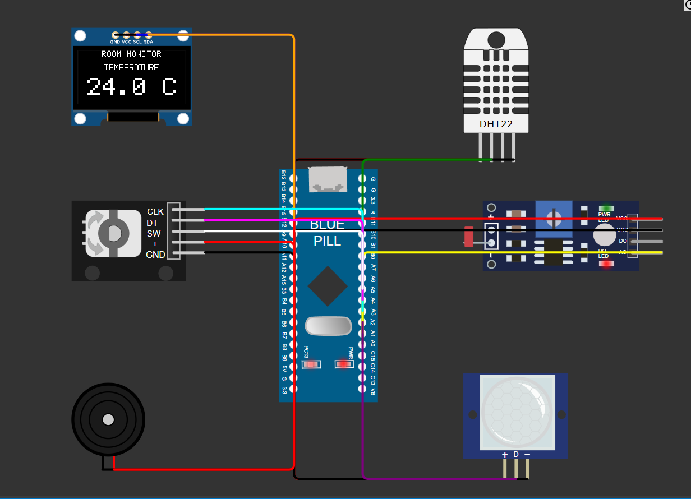

# FreeRTOS Multisensor Room Monitor

A room-monitoring node for the STM32F103 "Blue Pill", built on native FreeRTOS
and the STM32 HAL (no Arduino). It measures temperature, humidity, ambient light
and motion, shows one measurement at a time on an OLED, lets the user switch
between measurements with a rotary encoder, sounds a buzzer when the temperature
leaves a comfortable range, and goes quiet when nobody is in the room.

The project is designed and tested around a Wokwi simulation of the circuit.

---

## Project Overview

Six FreeRTOS tasks share the work, each with one clear job and a priority chosen
for its timing needs:
- **Sensing:** a DHT22 (temperature and humidity), an LDR module (relative
  light, 0-100 %) and a PIR motion sensor.
- **Output:** a 128x64 SSD1306 OLED, a PWM-driven buzzer, a heartbeat LED and
  a serial log.
- **Input:** a KY-040 rotary encoder cycles the OLED through the measurements.
- **Behaviour:** after 15 s without motion the system goes INACTIVE (display
  blank, sensing and alarm paused). Motion brings it straight back.

Tasks communicate only through FreeRTOS primitives (queues, a queue set, an
event group and a mutex); there are no shared global variables. All decision
logic lives in plain C++ with no HAL or FreeRTOS dependencies, and has 20 host
unit tests.

## Features

- **Temperature and humidity** from a DHT22, bit-banged with microsecond
  timing from the Cortex-M3 DWT cycle counter, inside a critical section.
- **Ambient light** as a 0-100 % relative level from the LDR module (ADC1).
- **Motion detection** from a PIR sensor, sampled every 100 ms.
- **One-measurement OLED UI:** a custom 5x7 font engine with integer
  scaling. It shows `ROOM MONITOR`, the measurement label and a large value.
- **Encoder navigation:** clockwise cycles Temperature -> Humidity -> Light ->
  Motion, counterclockwise goes the other way, wrapping at both ends.
- **Temperature alarm:** a 1 kHz buzzer (TIM1_CH1 hardware PWM) sounds while
  the temperature is outside 18.0-30.0 °C, and the OLED shows `ALARM LOW` or
  `ALARM HIGH`.
- **ACTIVE/INACTIVE power behaviour** driven by the PIR, with a 15 s timeout.
- **Mutex-protected serial logging** (USART1, 115200 baud) with a boot banner,
  every sample and every state change.
- **20 Unity unit tests** run on the host (`pio test -e native`).
- **Static analysis** with cppcheck (`pio check`); every finding is documented.

## Learning Objectives

This project demonstrates:
- **Structuring firmware as cooperating RTOS tasks**, with priorities
  justified by timing needs rather than habit.
- **Choosing the right IPC primitive for each job:** latest-value queues,
  one queue per consumer, a queue set to block on two sources, an event group
  for shared status flags, and a mutex with priority inheritance for a shared
  peripheral.
- **Deterministic periodic scheduling** with `vTaskDelayUntil()`.
- **Timing-critical bit-banging under an RTOS:** keeping a critical section
  short and doing everything else outside it.
- **Register-level peripheral work with the STM32 HAL:** ADC, I2C, USART,
  advanced-timer PWM, and the DWT cycle counter.
- **Separating hardware-independent logic** so it can be unit tested on a
  PC.
- **Engineering hygiene:** static analysis with justified resolutions,
  milestone commits, and a running development log.

## System Architecture

The firmware has three layers:

| Layer | Contents |
|---|---|
| **Application tasks** | `SensorTask`, `MotionTask`, `InputTask`, `AlarmTask`, `StateTask`, `DisplayTask` (one module each) |
| **Pure logic** (`*_logic.cpp`) | Temperature evaluation, state transitions, display-mode navigation, light scaling, DHT22 decoding, the font engine and screen layout. No HAL or FreeRTOS includes; unit tested on the host. |
| **Platform** | STM32Cube HAL drivers, FreeRTOS 10.3.1 with a project-specific Cortex-M3 port (see [Engineering Decisions](#engineering-decisions)) |

Data flows in one direction. The sensor and input tasks produce samples,
modes and status flags. Consumers (display, alarm, state machine) receive them
through RTOS objects created in one place, `rtos_objects_create()`. Each
peripheral handle belongs to exactly one module; the only peripheral shared
between tasks, the UART, is behind a mutex.

Startup follows a fixed order. `main()` does the MCU bring-up (vector table,
`HAL_Init`, clock) and calls `app_main()`, which initialises the hardware,
creates the RTOS objects, creates the tasks and starts the scheduler. Any
startup failure is logged as a `FATAL:` line.

## FreeRTOS Architecture

- **Kernel:** FreeRTOS 10.3.1 (STM32Cube middleware), preemptive, 1 kHz
  tick, `heap_4` with a 10 KB heap.
- **Scheduling:** fixed priorities 1-3. Periodic tasks use
  `vTaskDelayUntil()`, so their periods do not drift with execution time.
  Every task blocks on each loop iteration; none busy-waits.
- **Port:** a project-specific Cortex-M3 port that runs correctly under
  Wokwi's CPU emulation:
  - context switches happen synchronously inside the SVC handler (yields) and
    the SysTick handler (ticks); PendSV is never used;
  - critical sections gate the SysTick interrupt, and recover any ticks that
    fell inside them from the DWT cycle counter.

  See [Engineering Decisions](#engineering-decisions) and
  [`docs/design-notes.md`](docs/design-notes.md#freertos-port-wokwi-specific).
- **Tick handling:** the port owns `SysTick_Handler`. The FreeRTOS tick hook
  (`vApplicationTickHook`) advances the HAL tick, so HAL timeouts keep working.
- **Kernel objects:** 3 queues, 1 queue set, 1 event group and 1 mutex,
  documented in [`docs/design-notes.md`](docs/design-notes.md).
- **Optional kernel features enabled:** mutexes, queue sets and event groups.
  Task selection uses the generic (not the `clz`-optimised) path.

## Hardware / Simulated Components

The circuit is defined in [`diagram.json`](diagram.json) for Wokwi.

| Component | Part | Role |
|---|---|---|
| STM32F103C8T6 "Blue Pill" | `board-stm32-bluepill` | MCU. Runs from the internal 8 MHz HSI oscillator; no PLL is configured. |
| DHT22 | `wokwi-dht22` | Temperature and humidity (FR-01, FR-02) |
| LDR module | `wokwi-photoresistor-sensor` | Ambient light via analog out (FR-03) |
| PIR sensor | `wokwi-pir-motion-sensor` | Motion (FR-04) |
| SSD1306 OLED, 128x64, I2C | `board-ssd1306` | User interface (FR-05) |
| KY-040 rotary encoder | `wokwi-ky-040` | Measurement selection (FR-06) |
| Buzzer | `wokwi-buzzer` | Temperature alarm (FR-07) |
| On-board LED (PC13) | part of the Blue Pill | Heartbeat |
| Serial monitor | `$serialMonitor` | USART1 log |

## Pin Configuration

| Pin | Connected to | Configuration |
|---|---|---|
| PA0 | DHT22 data | Open-drain output / input with pull-up, switched at register level during a read |
| PA1 | LDR module AO | Analog input, ADC1 channel 1 |
| PA2 | PIR OUT | Digital input |
| PA3 | Encoder CLK | Input, pull-up |
| PA4 | Encoder DT | Input, pull-up |
| PA5 | Encoder SW | Input, pull-up |
| PA8 | Buzzer | TIM1_CH1 alternate function, 1 kHz PWM, 50 % duty |
| PA9 | Serial monitor RX | USART1 TX, 115200 8N1 |
| PA10 | Serial monitor TX | USART1 RX (wired; the firmware only transmits) |
| PB6 | OLED SCL | I2C1 SCL, open-drain alternate function |
| PB7 | OLED SDA | I2C1 SDA, open-drain alternate function |
| PC13 | On-board LED | Push-pull output, heartbeat |

## Task Design

| Task | Trigger | Priority | Stack (words) | Responsibility |
|---|---|---|---|---|
| `InputTask` | 5 ms, `vTaskDelayUntil` | 3 | 128 | Decode the encoder, step the display mode, log button presses |
| `MotionTask` | 100 ms, `vTaskDelayUntil` | 3 | 128 | Sample the PIR, mirror it into `EVENT_MOTION` |
| `SensorTask` | 2000 ms, `vTaskDelayUntil` | 2 | 256 | Read the DHT22 and LDR, publish a `SensorData` sample, toggle the heartbeat |
| `AlarmTask` | each sample (500 ms timeout) | 2 | 128 | Evaluate the temperature, drive the PWM buzzer, own `EVENT_ALARM` |
| `StateTask` | `EVENT_MOTION` with a 15 s timeout | 2 | 128 | ACTIVE/INACTIVE state machine, own `EVENT_ACTIVE` |
| `DisplayTask` | queue set (250 ms timeout) | 1 | 256 | Sole owner of the OLED: render and flush |

Why these priorities:
- **InputTask and MotionTask (3):** encoder edges arrive milliseconds apart,
  and the PIR drives the wake-up.
- **SensorTask, AlarmTask and StateTask (2):** they work on 2 s and 15 s
  timescales. The DHT22's microsecond timing is protected by a critical
  section, not by priority.
- **DisplayTask (1):** a full OLED flush takes about 100 ms of I2C, which a
  person does not notice, so it runs at the lowest priority and never delays
  sampling.

The shared sample type:

```cpp
struct SensorData { float temperature; float humidity; int lightLevel; bool motionDetected; };
```

## Inter-Task Communication

| Object | Type | Producer | Consumer | Purpose |
|---|---|---|---|---|
| `xDisplayQueue` | queue, 1 x `SensorData` | SensorTask | DisplayTask | Latest sample for the OLED |
| `xAlarmQueue` | queue, 1 x `SensorData` | SensorTask | AlarmTask | Latest sample for the alarm |
| `xModeQueue` | queue, 1 x `DisplayMode` | InputTask | DisplayTask | Mode chosen with the encoder |
| `xDisplayEvents` | queue set {display, mode} | (both queues) | DisplayTask | Block on a sample *or* a mode change |
| `xSystemEvents` | event group | see below | see below | System-wide status flags |
| `serialMutex` | mutex | all tasks | USART1 | One whole log line at a time |

| Event bit | Set / cleared by | Read by |
|---|---|---|
| `EVENT_ACTIVE` (BIT0) | Set at boot; then StateTask | DisplayTask, InputTask, SensorTask, AlarmTask |
| `EVENT_MOTION` (BIT1) | MotionTask (every 100 ms) | StateTask, DisplayTask, SensorTask |
| `EVENT_ALARM` (BIT2) | AlarmTask | DisplayTask |

Key choices:
- **One queue per consumer.** A queue item is removed by whichever task
  receives it, so one shared queue would give each sample to only one of the
  two consumers.
- **Length-1 queues written with `xQueueOverwrite()`.** Consumers only need
  the newest value, and producers never block.
- **A mutex, not a binary semaphore, for the UART.** Priority inheritance
  bounds how long a higher-priority task can wait for a lower-priority one
  that is holding it.

Every object is documented in
[`docs/design-notes.md`](docs/design-notes.md): its producer, consumer, who
sets and clears it, and why it exists.

## State Machine

| From | Condition | To | Effect |
|---|---|---|---|
| ACTIVE | motion | ACTIVE | 15 s inactivity timer restarts |
| ACTIVE | no motion for 15 s (FR-09) | INACTIVE | `EVENT_ACTIVE` cleared |
| INACTIVE | motion (FR-10) | ACTIVE | `EVENT_ACTIVE` set |
| INACTIVE | no motion | INACTIVE | none |

The system boots ACTIVE. If motion and an expired timeout are seen at the same
time, motion wins.

| | ACTIVE | INACTIVE |
|---|---|---|
| OLED | shows the selected measurement | blank, no rendering |
| Sensing (DHT22, LDR) | every 2 s | skipped (the heartbeat keeps running) |
| Encoder | changes the mode | ignored |
| Alarm | sounds if out of range | silenced |
| PIR | monitored | monitored |

The transition rule is the pure function
`evaluateSystemState(current, motionDetected, timeoutElapsed)`. `StateTask`
supplies its inputs by waiting on `EVENT_MOTION` for the time remaining in the
15 s window.

## Repository Structure

```
.
├── src/                    Application source (C++)
│   ├── main.cpp            main() (MCU bring-up) and app_main() (startup sequence)
│   ├── sensors.cpp         SensorTask: DHT22 + LDR, sample publishing
│   ├── dht22.cpp           DHT22 driver: DWT timing, critical section
│   ├── motion.cpp          MotionTask: PIR -> EVENT_MOTION
│   ├── input.cpp           InputTask: rotary encoder -> xModeQueue
│   ├── alarm.cpp           AlarmTask: temperature alarm, TIM1 PWM buzzer
│   ├── system_state.cpp    StateTask: ACTIVE/INACTIVE
│   ├── display.cpp         DisplayTask: SSD1306 driver and rendering
│   ├── rtos_objects.cpp    Creation of all queues, event group and mutex
│   ├── serial_log.cpp      USART1 logging behind serialMutex
│   └── *_logic.cpp         Hardware-independent logic (unit tested)
├── include/                Headers for each module, FreeRTOSConfig.h, and the
│                           port's portmacro.h
├── lib/freertos_port_patch FreeRTOS Cortex-M3 port: synchronous SVC/SysTick
│                           switching, SysTick-gated critical sections
├── test/                   Unity tests (alarm, light level, navigation, state)
├── docs/
│   ├── design-notes.md     Tasks and every RTOS object: roles and rationale
│   ├── static-analysis.md  Every cppcheck finding with cause and resolution
│   └── dev-log.md          Problems hit and how they were solved
├── scripts/                Build helper for the native test toolchain
├── diagram.json            Wokwi circuit
├── wokwi.toml              Wokwi firmware / GDB settings
└── platformio.ini          Build, test and check environments
```

## Getting Started

**Prerequisites**
- [Visual Studio Code](https://code.visualstudio.com/) with the
  [PlatformIO IDE](https://platformio.org/install/ide?install=vscode)
  extension, or PlatformIO Core (`pio`) on the command line.
- The [Wokwi for VS Code](https://docs.wokwi.com/vscode/getting-started)
  extension (with a Wokwi license) to run the simulation.

PlatformIO downloads everything else on the first build: the ST STM32
platform, the STM32Cube framework, the ARM GCC toolchain, FreeRTOS and, for
unit tests on Windows, a MinGW toolchain.

**Clone and open**

```bash
git clone <repository-url>
cd bca182-freertos-multisensor
code .
```

## Building the Project

```bash
pio run
```

This builds the `bluepill_f103c8` environment (the default) and produces
`.pio/build/bluepill_f103c8/firmware.bin` and `firmware.elf`, which Wokwi
loads through `wokwi.toml`. The build finishes with no compiler warnings. At
the time of writing it uses about 20 KB of flash (31 %) and 12 KB of RAM
(59 %), including the 10 KB FreeRTOS heap.

On startup the firmware prints:

```
BCA182 FreeRTOS Multisensor
System starting...
```

## Running the Wokwi Simulation



*The full circuit in Wokwi, as defined in [`diagram.json`](diagram.json). The
OLED is showing the TEMPERATURE screen.*

> **PLACEHOLDER: still to be written.** Starting the simulation from VS Code,
> the expected serial output, and how to use the encoder, PIR and DHT22
> controls.

The FreeRTOS scheduler runs correctly in Wokwi under the project's custom
port. In the Wokwi terminal, all six tasks start, SensorTask logs a sample
every 2 s, and StateTask switches the system to INACTIVE after 15 s without
motion. Why a custom port is needed is covered under
[Engineering Decisions](#engineering-decisions).

## Unit Testing

All decision logic is in `*_logic.cpp` files that include neither the HAL nor
FreeRTOS, so it compiles and runs on a PC:

```bash
pio test -e native
```

**20 tests in 4 suites, all passing:**

| Suite | Function under test | Tests |
|---|---|---|
| `test_alarm` | `evaluateTemperature()` | below low limit, exactly 18.0, normal, exactly 30.0, above high limit |
| `test_navigation` | `nextDisplayMode()` / `previousDisplayMode()` | forward, backward, wrap MOTION->TEMPERATURE, wrap TEMPERATURE->MOTION, next/previous are inverse, four steps is a full cycle |
| `test_state` | `evaluateSystemState()` | ACTIVE without timeout, ACTIVE with timeout, INACTIVE without motion, INACTIVE with motion, motion overrides an elapsed timeout |
| `test_light_level` | `lightPercentFromAdc()` | full scale -> 0 %, zero -> 100 %, mid-scale -> 50 %, out-of-range clamped |

Each suite was checked by deliberately breaking the function under test (for
example changing `<` to `<=` at a temperature limit) and confirming the
relevant tests fail.

On Windows, the native environment uses PlatformIO's MinGW toolchain package.
A small pre-build script (`scripts/native_toolchain.py`) puts it on `PATH`,
compiles as C++14 like the firmware, and links the runtime statically.

## Static Code Analysis

```bash
pio check
```

cppcheck 2.11 initially reported **72 findings, all low severity (style);
none high or medium**:
- **2 fixed:** C-style casts in the logging code, replaced with
  `reinterpret_cast` / `static_cast`.
- **58 false positives:** `unusedFunction`. `pio check` analyses one file at
  a time, so it cannot see calls made from other files. The check is disabled
  for those runs and replaced by a whole-program cppcheck run, which reports
  no unused functions.
- **12 accepted:** C-style casts that are inside CMSIS register macros (`DWT`,
  `SCB`, `I2C1`) and FreeRTOS's `xSemaphoreGive()`, not in project code.

Every finding, with file, line, cause and resolution, is listed in
[`docs/static-analysis.md`](docs/static-analysis.md).

## Functional Verification

> **PLACEHOLDER: results to be recorded from simulation or hardware runs.**
> Planned checks, one per functional requirement:
>
> | Requirement | What to verify | Result |
> |---|---|---|
> | FR-01 / FR-02 | Temperature and humidity logged every 2 s and shown on the OLED | *pending* |
> | FR-03 | Light level shown as 0-100 % and follows the LDR control | *pending* |
> | FR-04 | PIR motion reflected on the MOTION screen and in the log | *pending* |
> | FR-05 | OLED shows exactly one measurement | *pending* |
> | FR-06 | Encoder cycles the modes in both directions with wraparound | *pending* |
> | FR-07 | Buzzer (about 1 kHz) sounds below 18.0 °C and above 30.0 °C only | *pending* |
> | FR-08 / FR-09 | INACTIVE after 15 s without motion: OLED blank, no sensing | *pending* |
> | FR-10 | Motion returns the system to ACTIVE | *pending* |

## Engineering Decisions

- **Pure logic, separated from hardware.** Every decision (alarm
  thresholds, state transitions, navigation, light scaling, DHT22 decoding,
  screen layout) is a plain function in a `*_logic.cpp` file. The tasks only
  gather inputs, call the logic and act on the result. This is what makes
  20 host tests possible without mocking the HAL or the RTOS.
- **The DHT22 critical section only measures.** The 1-2 ms start pulse uses
  `vTaskDelay`, so other tasks keep running. Only the 4-5 ms capture phase runs inside
  `taskENTER_CRITICAL()`, and all it does there is record pulse widths from
  the DWT cycle counter. Decoding, the checksum and logging happen afterwards.
  Every wait is bounded by both a cycle timeout and an iteration cap, so a
  missing sensor cannot hang the system.
- **A failed sensor read skips the cycle.** Consumers never receive a
  sample built from invalid data; the failure reason is logged instead.
- **Level event bits with a hold-off.** `EVENT_MOTION` stays set for as long
  as there is motion, so any task can read the current state. `StateTask`
  would spin if it simply waited on a bit that stays set, so after each motion
  it blocks for 500 ms before waiting again.
- **Queue set plus a short timeout.** Event groups cannot join a queue set,
  so `DisplayTask` waits on its queue set with a 250 ms timeout, checks the
  event bits, and redraws only when something on screen has changed.
- **Single ownership of peripherals.** The OLED/I2C, the ADC and the PWM
  timer each belong to one task and need no locking. Only the UART is shared,
  behind a mutex.
- **Clock-aware PWM.** The MCU turned out to run from the 8 MHz HSI, not the
  72 MHz often assumed for a Blue Pill (verified from the startup code and
  the binary). The buzzer's TIM1 prescaler is computed at runtime from the
  real APB2 timer clock (8 MHz -> PSC 7, ARR 999 -> 1 kHz), so adding a PLL
  later will not change the tone.
- **A custom FreeRTOS port, designed from measured simulator behaviour.**
  Under Wokwi the stock port hung: the scheduler never started the first
  task, and once that was fixed, context switches looped forever. In-firmware
  probes found where the simulator's Cortex-M3 emulation departs from the
  ARMv7-M architecture:
  - `cpsie`/`cpsid` are inverted;
  - BASEPRI is not implemented, and PRIMASK does not block SysTick;
  - an exception pended by a store to `ICSR` (how PendSV is requested)
    returns to that store, so it runs again forever.

  Further probes showed what does work: SVC and SysTick return correctly,
  and gating SysTick with its `TICKINT` bit stops it cleanly. The port in
  `lib/freertos_port_patch` and `include/portmacro.h` is built only on those:
  - context switches happen synchronously inside the SVC handler (yields) and
    the SysTick handler (ticks), with no PendSV at all;
  - critical sections gate `TICKINT`. When one ends, the tick boundaries that
    passed inside it are computed from the DWT cycle counter and SysTick's
    position at entry, and replayed *before* the tick interrupt is re-enabled.
    So even the 4-5 ms DHT22 read keeps the tick count right, apart from a
    rare one-tick error if a tick boundary lands in the few instructions at
    either edge.

  With it, the scheduler runs correctly in Wokwi. The investigation, the probe
  results and the design are in [`docs/dev-log.md`](docs/dev-log.md) and
  [`docs/design-notes.md`](docs/design-notes.md#freertos-port-wokwi-specific).
